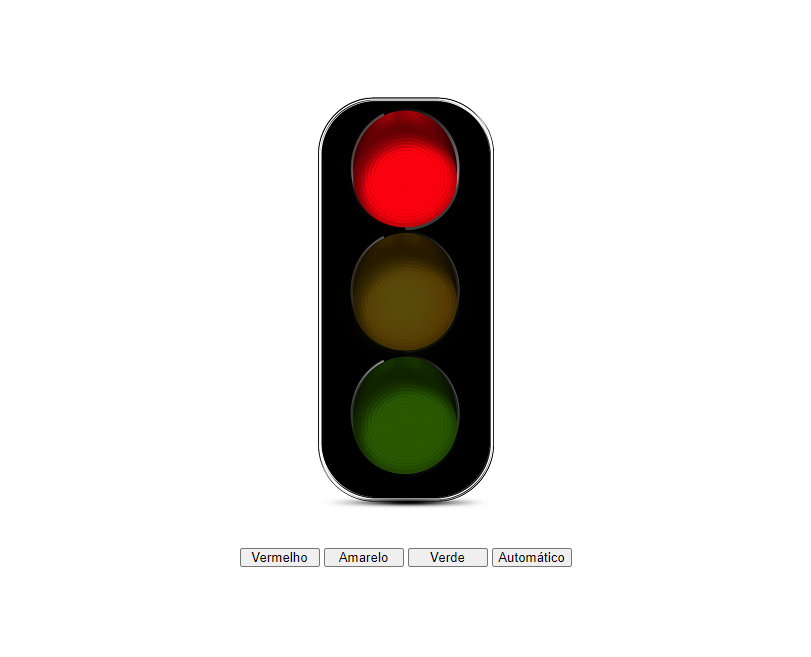

# Semáforo Eletrônico 

>     e seus funcionamentos

Projeto construído com ação individual e automática
 de um Farol sinalizador.

 🔸 [Clique aqui para acessar](https://fabiocoimbra1.github.io/SemaforoJS/)

 ## ⚒️ Tecnologias

- HTML
- CSS
- JAVASCRIPT
- GIT
- GITHUB

## A importância do projeto

Projeto trouxe aprendizado principalmente na manipulação de ações em JavaScript. Aprendi como projeto pode ir muito mais além de uma página estática.

## 💛 Contato

fabiocoimbra38@gmail.com

